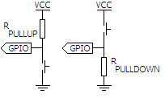

# Components

Mosfet transistors can be easily used as a digital switch.

A darlington transistor contains two transistors allowing higher current
amplification than a single transitor.

## IRF520 Mosfet


## 30N06L Mosfet


## BC517 Darlington Transistor


## BD139 Transistor


# Circuits

## Speaker

The following circuit is required for code [app2](/app2).


The following calculation is an example to figure out the resistor value that
goes with the speaker.


## Potentiometer

The following circuit is required for code
[potentiometer](app/examples/potentiometer.rs) and
[potentiometer2](app/examples/potentiometer2.rs)


## Display

ALERT: The rotating logo code is not very clean.

The following connections are required for code
[display](app/examples/display.rs),
[display2](app/examples/display2.rs)
[rotating logo](https://github.com/Dhole/ssd1306/blob/master/examples/image_i2c.rs)

```
GND -> GND
VCC -> +5V
PB9 -> SDA
PB8 -> SCK

PB5 -> +---+
       | O |
GND -> +---+
```

About pull-up and pull-down:

